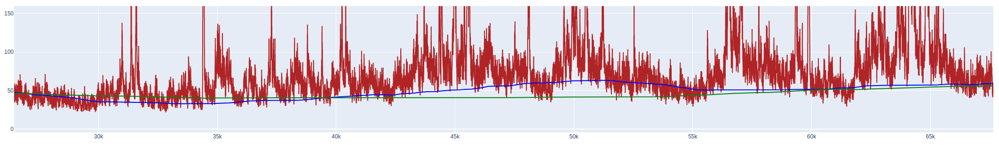

#  Gas fee strategy visualization

## Start
```bash
pip install -r req.txt
export INFURA_PROJECT_ID=...
python main.py
```

Go to http://127.0.0.1:8050/

## Params
Days to fetch - How many blocks fetch from mainnet  
Percentile (min 0, max 100)  
Blocks to calculate - How many previous blocks to consider when calculating the percentile


## Output 
  

If recommended price is higher than the current gas fee, it's time to deposit.
